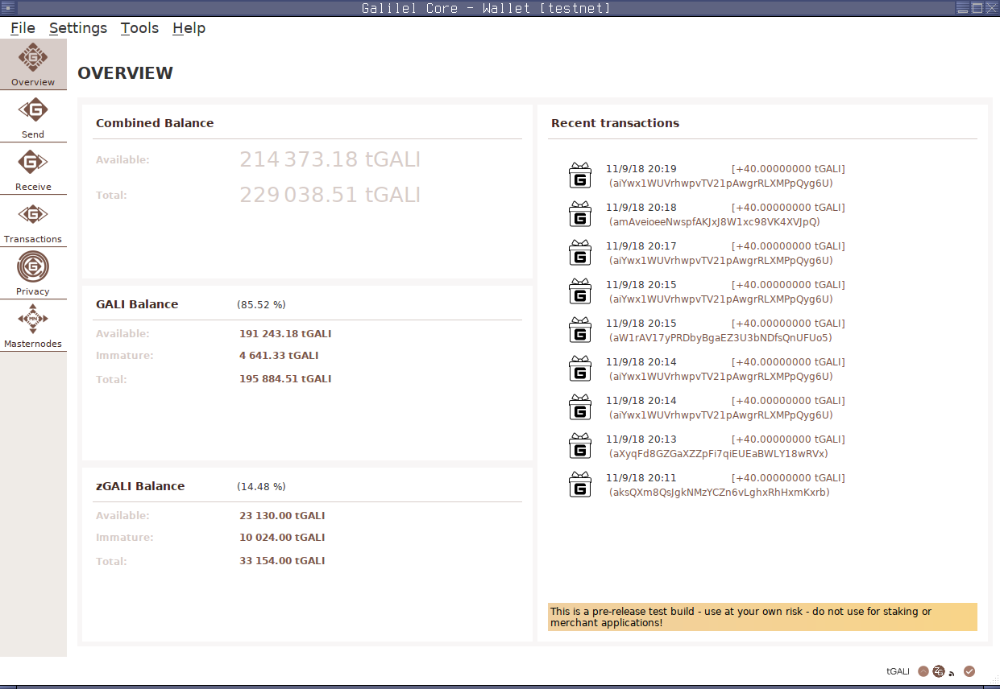
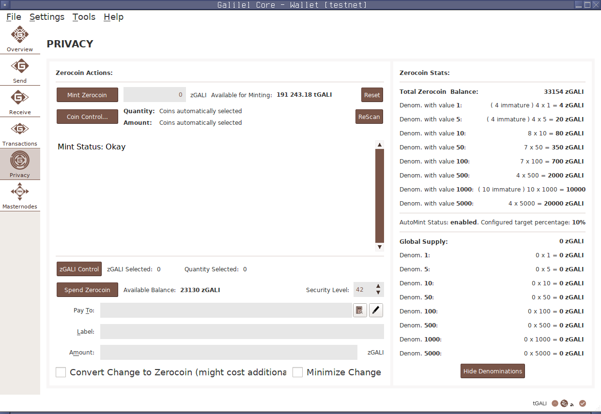

# Introduction

The first Proof-of-Work, Proof-of-Stake, Proof-of-Burn crypto currency with
Hybrid Consensus Algorithm and Masternode voting for period based reward
burning.

Galilel Coin (GALI and zGALI) is an open-source public and private
Proof-of-Stake digital crypto currency for fast (using SwiftX), private
(Zerocoin protocol) and secure micro transactions. Our main goal is to create a
decentralized fully secure and anonymous network to run applications, which do
not rely on any central body control. By having a distributed system, thousands
of users will be responsible for maintaining the application and data so that
there is no single point of failure.

While Zerocoin solves the traceable reward generation problem, Galilel will
implement hybrid offline Proof-of-Stake (ghPoS) for public and private coins
which is always on with 5% of the block reward paid out if offline wallet finds
a block. The Term Deposit (gTD) function allow to lock coins for a certain
period and generate predictable rewards. Masternode owners get the possibility
to vote for reward reduction or complete burning for a specific period to
reduce coin generation. The Galilel Money Supply Control (gMSC), effectively
Proof-of-Burn v2 burns only rewards, never term deposits and development
budget. The period for coin burning will be 1 month with a range between 0% -
100%. Every month is applicable for voting. Galilel Instant On Masternode
(gIOMN) implements a shared blockchain to run one-to-many wallet daemons in a
client server model. It is comparable to "Instant On" model available in
Electrum client.

# Coin Specifications

* Coin Name: Galilel
* Coin Ticker: GALI
* Hash Algorithm: Quark
* Consensus Algorithm: PoS + zPoS Hybrid
* Block Size: 2 MB
* Block Time: 60 Seconds (Re-targeting every block)
* RPC Port: 36002
* P2P Port: 36001
* Type: PoW / PoS / zPoS / MN
* Minimum Staking Age: 2 Hours
* Maturity: 120 confirmations
* Send Eligibility: 6 confirmations
* Rewards (till block 1500): MN 60%, PoW 40%
* Rewards (till block 205000): MN 60%, PoS 40%
* Rewards (from block 205001): MN 70%, PoS 30%
* Last PoW Block: 1.500
* Masternode Collateral: 15.000
* Max Coin Supply (January 2020): 19.035.999 GALI
* Max Coin Supply (January 2030): 45.315.999 GALI
* Max Coin Supply (January 2040): 71.595.999 GALI
* Max Coin Supply (January 2050): 97.875.999 GALI
* Dynamic Coin Supply: All transaction fees & zGALI minting fees are burnt
* Community Donation Address: https://explorer.galilel.cloud/address/UUr5nDmykhun1HWM7mJAqLVeLzoGtx19dX
* Dev Budget (from block 250001): 10% in monthly superblock

# Zerocoin Specifications

* Zerocoin v1 activation: block 250000
* Zerocoin v2 activation: block 340000 (planned)
* zGALI Automint: 10%
* zGALI Rewards (from block 340001): MN 50%, zPoS 50%
* zGALI Denominators: 1, 5, 10, 50, 100, 500, 1000, 5000
* Accumulator Modulus: RSA-2048
* Maturity: 240 confirmations
* Send Eligibility: 20 confirmations
* Fees (mint): 0.01 GALI per minted zGALI denomination
* Fees (spend): No fee

With Zerocoin v2 activation at block 340001 the reward structure becomes
dependent from the staking type. If public Proof-of-Stake (GALI) and staker
finds a block, 70% paid to masternode and 30% to staker. If private
Proof-of-Stake (zGALI) and staker finds a block, 50% paid to masternode and 50%
to staker.

# Proof-of-Work Rewards

Proof-of-Work is used as instamine protection and will end at block 1500.

Block Height   | Reward                 | MN  | PoW | Supply  | Runtime | Stage End
---------------|------------------------|-----|-----|---------|---------|-----------
Block 1        | 220.000 GALI (premine) | 60% | 40% | 220.000 | 0 days  | 2018-05-25
Block 2 - 1500 |       1 GALI           | 60% | 40% | 221.499 | 1 day   | 2018-05-26

# Proof-of-Stake Rewards

Proof-of-Stake will start at block 1501.

Stages  | Block Height    | Reward   | MN  | PoS | Supply     | Runtime | Stage End
--------|-----------------|----------|-----|-----|------------|---------|-----------
Stage 1 |      1501-12000 | 100 GALI | 60% | 40% |  1.271.399 |  7 days | 2018-06-02
Stage 2 |     12001-22000 |  90 GALI | 60% | 40% |  2.171.309 |  7 days | 2018-06-09
Stage 3 |     22001-42000 |  80 GALI | 60% | 40% |  3.771.229 | 14 days | 2018-06-23
Stage 4 |    42001-100000 |  70 GALI | 60% | 40% |  7.831.159 | 40 days | 2018-08-02
Stage 5 |   100001-160000 |  60 GALI | 60% | 40% | 11.431.099 | 42 days | 2018-09-13
Stage 6 |   160001-205000 |  50 GALI | 60% | 40% | 13.681.049 | 31 days | 2018-10-14
Stage 7 |   205001-250000 |  25 GALI | 70% | 30% | 14.806.024 | 31 days | 2018-11-14
Stage 8 |   250001-340000 |  15 GALI | 70% | 30% | 16.156.009 | 62 days | 2019-01-15
Stage 9 |   340001-430000 |  10 GALI | 70% | 30% | 17.055.999 | 62 days | 2019-03-18
Stage X |  430001-ongoing |   5 GALI | 70% | 30% |    ongoing | ongoing |    ongoing

# Official Links

Website: https://galilel.cloud/

GitHub (Wallet): https://github.com/Galilel-Project/galilel/

GitHub (Project): https://github.com/Galilel-Project/

Block Explorer (Mainnet) : https://explorer.galilel.cloud/

Block Explorer 2 (Mainnet Aiodex): https://explorer.aiodex.com/GALI

Block Explorer (Testnet): https://explorer.testnet.galilel.cloud/

BitcoinTalk Announcement: https://bittcointalk.galilel.cloud

Twitter: https://twitter.com/GalilelEN

Discord: https://discord.galilel.cloud

Know Your Developer (KYD): https://review.kydcoin.io/galicoin/

# Exchanges

Graviex: https://graviex.net/markets/galibtc

Raisex: https://raisex.io/trade/GALI_BTC

Aiodex: https://aiodex.com/exchange/GALI_BTC

AltMarkets: https://altmarkets.cc/market/BTC-GALI

# Promotions

Masternodes.online: https://masternodes.online/currencies/GALI/

Coinlib.io: https://coinlib.io/coin/GALI/Galilel

MNtop: https://mntop.co.in/

mnode.club: https://mnode.club/g/info/GALI

Beam: https://beam.works/user/galilel/

Satoshi Solutions: https://satoshisolutions.online/

Chopcoin.io: https://gali.chopcoin.io/

NodeCheck.io: https://nodecheck.io/currency/GALI

CoinCodex: https://coincodex.com/crypto/galilel/

CoinGecko: https://www.coingecko.com/en/coins/galilel

WorldCoinIndex: https://coinpaprika.com/coin/gali-galilel/

Coinpaprika: https://coinpaprika.com/coin/gali-galilel/

# Donations

Galilel (GALI): UUr5nDmykhun1HWM7mJAqLVeLzoGtx19dX

Bitcoin (BTC): 13vZmvxWcpMxZPr2gtf4QBS8Q2En6kB3mo

Litecoin (LTC): MAfouCFTBX4hJWTmAvTpFSuwzUZr4gtxDv

Dogecoin (DOGE): DFY1iAcbX8uQDaFAFQckSGJfYBb6QzTuMi

# Wallet Screenshots

Since refactoring of Galilel v3.x with PIVX 3.1.1 codebase, the wallet supports
zGALIv1 minting and spending. Wallet and Zerocoin privacy screenshot:

